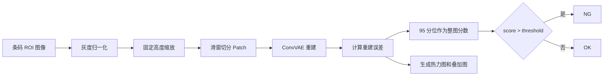

# 基于 Patch ConvVAE 的一维码异常检测

本项目面向已经裁切、转正后的一维码 ROI 图像，使用 Patch ConvVAE 对条码区域进行 OK/NG 异常检测。项目核心思想是：只用 OK 样本学习正常条码纹理分布，推理时通过重建误差判断输入图像是否偏离正常分布，并输出异常热力图用于人工复核。

当前项目主要用于 Code128 药监码条码区域检测。它不负责原图定位、旋转转正、条码解码和具体缺陷分类，而是专注于对稳定裁切后的条码 ROI 做异常筛查。

## 项目特点

- 基于卷积变分自编码器 ConvVAE，不依赖大量缺陷类别标注。
- 仅使用 OK 样本训练，NG 样本用于阈值标定和独立评估。
- 使用滑动窗口切分 `64x64` patch，可定位局部异常区域。
- 支持 GUI 和命令行两种使用方式。
- 输出 `results.csv`、异常热力图和原图叠加图。
- 支持 ONNX / OpenVINO 导出，方便在 CPU 环境部署。
- 针对 Windows 中文路径做了图像读写兼容处理。

## 示例效果

下面展示的是公司一数据中的一张 NG 样本检测结果。该样本模型输出分数为 `0.00967109`，阈值为 `0.00128267`，最终判定为 `NG`。

### 软件检测页面


### 测试原图


### 异常热力图


### 原图叠加图


## 方法概述

VAE 的训练目标不是直接学习“这张图是 OK 还是 NG”，而是学习正常 OK 条码 patch 的重建能力。

```text
OK 条码 ROI
  -> 灰度读取和归一化
  -> 缩放到固定高度
  -> 切分为多个 64x64 patch
  -> ConvVAE 重建 patch
  -> 计算重建误差
  -> 标定阈值
  -> 输出 OK / NG
```

推理时，如果某张图的局部 patch 无法被模型很好重建，说明它和正常条码纹理分布差异较大，整图异常分数会上升。当异常分数超过阈值时，判定为 NG。



## 项目结构

```text
barcode/
  README.md                         # GitHub 项目说明
  项目框架说明.md                    # 更详细的项目框架说明
  train/                            # 本地训练数据
    ok/
    ng/
  test/                             # 本地测试数据
    ok/
    ng/
  barcode_vae_app/                  # 核心应用
    app.py                          # Tkinter GUI 入口
    run_app.bat                     # Windows 启动脚本
    install_windows_cpu.bat         # Windows CPU 环境安装脚本
    requirements.txt                # Python 依赖
    README.md                       # 应用快速使用说明
    PROJECT_FLOW_CN.md              # 流程说明
    PROJECT_SUMMARY_REPORT_CN.md    # 项目总结报告
    barcode_vae/                    # 核心算法模块
      config.py                     # 训练和推理配置
      model.py                      # ConvVAE 模型
      preprocess.py                 # 图像预处理和 patch 切分
      split.py                      # 数据集拆分
      trainer.py                    # 训练、阈值标定和评估
      infer.py                      # 推理和可视化输出
      metrics.py                    # 阈值选择和评估指标
      cli.py                        # 命令行入口
      openvino_export.py            # OpenVINO 导出
      openvino_infer.py             # OpenVINO 推理
    openvino_ir/                    # OpenVINO 模型导出文件
    paddleocr_setup/                # OCR 辅助实验脚本
    runs/                           # 训练和检测实验输出
```

## 数据格式

推荐输入数据结构如下：

```text
dataset/
  ok/
    00001.bmp
    00002.bmp
    ...
  ng/
    00001.bmp
    00002.bmp
    ...
```

要求：

- 图片应为已经裁切好的条码 ROI。
- 训练和推理图片应保持同方向、同规格、同裁切范围。
- 支持 `.bmp`、`.png`、`.jpg`、`.jpeg`、`.tif`、`.tiff` 等常见格式。
- VAE 训练阶段只使用 OK 样本，NG 样本只参与阈值标定和测试评估。

## 当前实验结果

下面结果来自 6.8 测试汇总报告中的“公司一单独训练”结果，只展示公司一数据，便于和上方示例图保持一致。

| 指标 | 数值 |
|---|---:|
| 测试 OK 数量 | 150 |
| 测试 NG 数量 | 280 |
| 阈值 threshold | 0.00128267 |
| OK 错判 NG | 6/150 |
| NG 错判 OK | 21/280 |
| OK 正确率 | 96.00% |
| NG 正确率 | 92.50% |
| 总准确率 | 93.72% |

该结果说明：在公司一单独训练和公司一测试集上，模型对 OK 样本保持较高通过率，同时能检出大部分 NG 样本。由于 VAE 对输入分布一致性敏感，跨公司、跨规格或裁切方式变化较大的数据仍需要单独评估。

## 环境安装

进入核心应用目录：

```bash
cd barcode_vae_app
```

Windows CPU 环境可使用项目脚本：

```bash
install_windows_cpu.bat
```

也可以手动安装：

```bash
python -m venv .venv
.venv\Scripts\activate
python -m pip install --upgrade pip
pip install torch --index-url https://download.pytorch.org/whl/cpu
pip install -r requirements.txt
```

`requirements.txt` 中包含 OpenCV、NumPy、OpenVINO、ONNX 和 PaddleOCR 相关依赖。PyTorch 建议根据自己的 CUDA / CPU 环境单独安装。

## GUI 使用

启动桌面应用：

```bash
cd barcode_vae_app
python app.py
```

GUI 主要包含两部分：

- 训练区：选择 OK/NG 数据目录，设置输出目录、epoch、batch size 和 loss 类型，一键完成训练、阈值标定和测试评估。
- 检测区：选择 `model.pt`、待检测图片或文件夹，批量输出检测 CSV、热力图和叠加图。

检测完成后，程序会生成：

```text
results.csv
heatmaps/
overlays/
```

## 命令行使用

训练、标定和评估：

```bash
cd barcode_vae_app
python -m barcode_vae.cli train ^
  --ok-dir path\to\ok ^
  --ng-dir path\to\ng ^
  --out-dir runs\exp1 ^
  --epochs 30 ^
  --batch-size 96 ^
  --loss-type mse
```

检测单张图片或文件夹：

```bash
python -m barcode_vae.cli detect ^
  --model runs\exp1\model.pt ^
  --input path\to\images ^
  --out-dir runs\detect
```

如果需要临时覆盖模型中保存的阈值，可以增加：

```bash
--threshold 0.001276
```

## 模型配置

默认关键参数位于 `barcode_vae/config.py`：

| 参数 | 默认值 | 说明 |
|---|---:|---|
| `target_height` | 160 | 输入图像统一缩放高度 |
| `patch_size` | 64 | VAE 输入 patch 尺寸 |
| `stride` | 32 | 滑窗步长 |
| `max_patches_per_image` | 32 | 每张训练图最多采样 patch 数 |
| `batch_size` | 96 | 训练 batch size |
| `epochs` | 30 | 默认训练轮数 |
| `learning_rate` | 0.001 | Adam 学习率 |
| `latent_dim` | 32 | VAE 潜变量维度 |
| `beta` | 0.0001 | KL 散度权重 |
| `loss_type` | `mse` | 重建损失类型 |
| `image_score_percentile` | 95 | 整图分数使用 patch 分数的 95 分位 |

支持的重建损失包括：

- `mse`：均方误差，速度快，作为默认方案。
- `ssim`：结构相似性损失，更关注纹理结构变化。
- `combined`：MSE 和 SSIM 的组合。
- `normalized_combined`：归一化后的组合损失，适合进一步实验调参。

## 输出文件说明

训练输出目录通常包含：

| 文件 | 说明 |
|---|---|
| `model.pt` | 模型权重、配置和阈值 |
| `config.json` | 训练参数和预处理参数 |
| `split.json` | OK/NG 数据拆分记录 |
| `train_history.json` | 每个 epoch 的 loss |
| `thresholds.json` | 阈值标定结果 |
| `evaluation.json` | 独立测试集评估指标 |
| `test_scores.csv` | 测试集中每张图片的分数 |

检测输出目录通常包含：

| 文件或目录 | 说明 |
|---|---|
| `results.csv` | 每张图片的分数、阈值、预测结果和可视化路径 |
| `heatmaps/` | 异常热力图 |
| `overlays/` | 原图叠加热力图 |

## OpenVINO 部署

导出 OpenVINO IR：

```bash
cd barcode_vae_app
python -m barcode_vae.openvino_export ^
  --model-pt runs\exp1\model.pt ^
  --out-dir openvino_ir
```

导出后会得到：

```text
convvae.onnx
convvae.xml
convvae.bin
meta.json
```

CPU 推理测试：

```bash
python -m barcode_vae.openvino_infer ^
  --ir-dir openvino_ir ^
  --image-dir path\to\test\images ^
  --runs 5
```

## 适用边界

该模型对输入分布一致性要求较高。训练和推理时应尽量保持：

- 条码方向一致。
- ROI 裁切范围一致。
- 条码规格一致。
- 图像高度、宽高比例和留白比例接近。
- 曝光、亮度和对比度分布接近。
- 使用对应规格训练得到的 `model.pt`。

如果预测图旋转了 90 度、裁切范围明显变化，或者条码规格与训练集不同，模型可能会给出很高的异常分数，从而大量判为 NG。

## 后续优化方向

- 增加更多真实产线 OK 样本，提升正常分布覆盖。
- 按条码规格分别训练模型，减少跨规格误判。
- 对阈值策略增加“低漏检优先”和“低误判优先”两种模式。
- 增加推理耗时统计，完善 CPU 部署指标。
- 整理公开示例图片，替换 README 中的图片占位。
- 增加单元测试和小型示例数据集，方便他人复现。

## 数据与发布说明

如果仓库需要公开发布，建议不要直接上传真实生产图片、客户数据、大体积模型权重或带有敏感路径的实验输出。可以只保留代码、文档、少量脱敏示例图和可复现实验说明。
